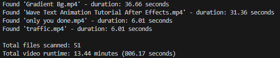

# Video Length Calculator

A simple Python script that recursively scans a folder (and all its subfolders) containing video files, sums their total duration, and counts the number of files processed.

## Features

- Supports the following video formats: `.mp4`, `.mov`, `.avi`, `.mkv`, `.flv`, `.wmv`
- Prints each file’s duration as it is processed
- Shows total number of files scanned
- Shows total video runtime in minutes and seconds
- Works recursively through subfolders

---

## Usage

1. Clone or download this repository.
2. Open `video_length_calculator.py` in a text editor.
3. Update the `folder` variable to point to the folder containing your videos:

```python
folder = r"C:\Users\YourName\Videos"
```

4. Run script from the terminal:
```
python video_length_calculator.py
```

## Example Output

Here's what the script looks like when it runs:



## Requirements:
- Python 3.10+
- MoviePy
```
pip install moviepy
```
